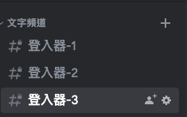
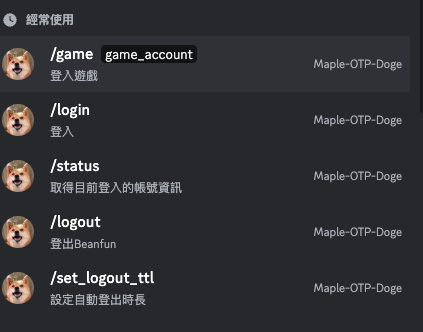
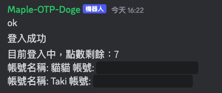

# Beanfun Discord Bot

這是一個允許多人在Discord頻道上共享同一個Beanfun登入器的機器人，目前僅限MapleStory(TMS)。

`此篇內容部分由chatGPT產生，還待改進。`

<!--ts-->
* [Beanfun Discord Bot](#beanfun-discord-bot)
* [簡介](#簡介)
   * [架構](#架構)
   * [可以拿來幹嘛呢?](#可以拿來幹嘛呢)
   * [安裝](#安裝)
      * [取得Discord伺服器id (guild id)](#取得discord伺服器id-guild-id)
      * [安裝@Linux/MacOS/WSL](#安裝linuxmacoswsl)
      * [安裝@Windows Docker Desktop](#安裝windows-docker-desktop)
      * [環境變數](#環境變數)
      * [Discord Bot註冊](#discord-bot註冊)
   * [使用指令](#使用指令)
   * [可能的QA](#可能的qa)

<!-- Created by https://github.com/ekalinin/github-markdown-toc -->
<!-- Added by: takidog, at: Wed Jul 12 17:18:01 CST 2023 -->

<!--te-->

# 簡介

這是一個Discord bot，**你必須要有一台裝置**架設這個bot

|  |  |
| -------------------- | -------------------- |
|  |  |

`/login` 後可以輸入 `/status` 查詢狀態

`/set_logout_ttl` 去設定多久後自動登出

`/game` 會auto-complete 告訴你有哪些帳號，輸入後他就會吐帳號密碼給你登入了😊

`/logout` 立即登出

`.sync` 同步指令!

## 架構

常見的Beanfun登入器架構是
```
你 <-> 登入器 <-> Beanfun網站
```
這個專案是
```
你 <-> Discord伺服器 <-> 你的的機器人 <-> Beanfun網站
```

## 可以拿來幹嘛呢?

1. 如果bot架設在NAS/Respberry/Cloud Services, 機器人保持開機的狀態
    你可以隨時方便的登入Beanfun，並且拿到Maplestory OTP密碼
    相對直接掃別人的QR code登入，安全一些些

2. 跟朋友共享同一組Beanfun帳號
    如果你是方塊大盤商，你需要請人幫你銷售
    又偏偏是凌晨才跟你要帳號密碼 🥲
    那你可以請他自己自助拿密碼了

    或是你跟我有一樣需求，跟朋友一起練一隻BUFF機
    那就沒問題了吧?

3. 懸賞服務用
    如果你的老闆沒有登入器，並不能給你OTP密碼，又要截QR code給他
    對方又不清楚你登入後的行為
    那在同一個Discord頻道上，可以一起看到登入器的狀態、用途、操作
    我想應該好一些些...
    吧


## 安裝

### 取得Discord伺服器id (guild id)

比較簡單的方式，可以直接對你的Discord伺服器，任意一個頻道右鍵->複製連結

你會獲得一串連結

`https://discord.com/channels/8OOOOOOOOOOOO7/98xxxxxxxxxxxx21`

其中的 `8OOOOOOOOOOOO7` 就是你的伺服器id了!

### 安裝@Linux/MacOS/WSL

首先，請確保你已經安裝了Docker。如果你還沒有安裝，請訪問[Docker](https://www.docker.com/)並按照指南進行安裝。

然後，你可以使用以下的命令來建立並運行Docker映像：

```bash

docker pull takidog/discord_beanfun:latest

docker run -d \
    -e BOT_TOKEN=<你的Discord bot token> \
    -e LIMIT_GUILD=<你的Discord server id> \
    takidog/discord_beanfun:latest

```

也可以在使用 [環境變數](#環境變數)調整細節

相信會使用Unix的你，不需要教您填入環境變數了🐙

### 安裝@Windows Docker Desktop

### 環境變數

以下是可用的環境變數及其默認值：

- `LIMIT_GUILD`：伺服器ID（無默認值），可以使用,進行分割
- `BOT_TOKEN`：Discord機器人token（無默認值）
- `LOGIN_TIME_OUT`：登入超時時間（默認值為180）
- `OTP_DISPLAY_TIME`：OTP顯示時間（默認值為20）
- `HIDDEN_PRIVATE_MESSAGE`：是否隱藏私人訊息（默認值為1）

### Discord Bot註冊

額外連結: [由@smallshawn95撰寫的教學](https://hackmd.io/@smallshawn95/python_discord_bot_base)

---

如果你還沒有Discord bot token，你需要在Discord Developer Portal中創建一個新的應用並註冊一個機器人來獲取token。以下是基本步驟：

1. 訪問[Discord Developer Portal](https://discord.com/developers/applications)。
2. 點擊“New Application”按鈕。
3. 給你的應用命名，然後點擊“Create”按鈕。
4. 在左側的導航欄中，點擊“Bot”菜單項。
5. 點擊“Add Bot”按鈕，然後在彈出的對話框中確認。
6. 在Bot頁面中，你可以看到你的token，你可以通過點擊“Copy”按鈕來複製它。

請注意，你應該要保護好你的token，不要讓它公開或分享給他人，因為有了token，任何人都可以使用你的機器人。

可以到OAuth2 -> URL Generateor
SCOPES勾選 `bot`
BOT PERMISSIONS 勾選 `Send Messages` `Attach Files`
複製連結，就可以將bot邀請到您的伺服器了!

## 使用指令

當你已經完成以上步驟並成功運行你的機器人後，你就可以在Discord上使用它了。以下是可用的命令：

- `login`：登入
- `status`：獲取當前登入的賬號信息
- `game`：登入遊戲
- `set_logout_ttl`：設置自動登出時間
- `logout`：登出Beanfun
- `.sync` 同步指令，如果斜線並沒有出現提示的話。

詳細的命令用法請參考源代碼。


## 可能的QA